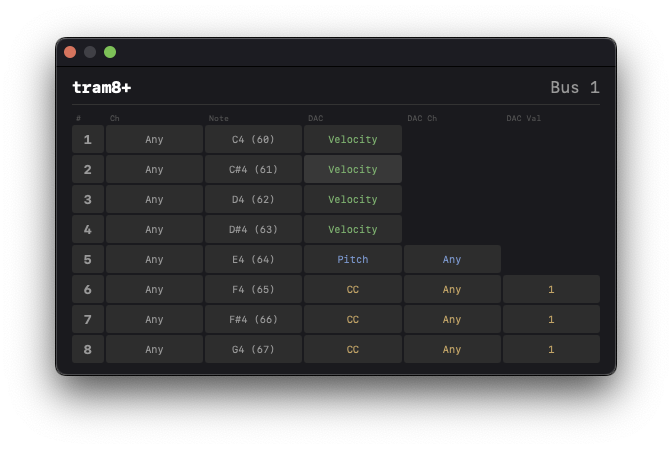

# tram8+

VST3 plugin and firmware for the Tram8 hardware module. Bridges a DAW to 8 CV/gate outputs via packed SysEx over MIDI.



## Architecture

- **VST3 Plugin** — receives MIDI note/CC events from the DAW, converts to packed SysEx messages, sends via CoreMIDI to the hardware
- **Firmware** — AVR-based, receives SysEx and drives 8 gate outputs + 12-bit DAC (MAX5825) for CV
- **Protocol** — shared header (`protocol/tram8_sysex.h`) defines the 7-bit packed message format

## DAC Modes

Each gate has an independent DAC mode:

| Mode | DAC Output |
|------|-----------|
| Velocity | Note velocity scaled to 0–5V |
| Pitch | 1V/oct from MIDI note number |
| CC | MIDI CC value scaled to 0–5V |
| Off | 0V |

## Building

### VST3 Plugin (macOS)

```sh
cd vst/build
XCODE_VERSION=15.0 cmake .. -DCMAKE_BUILD_TYPE=Release
cmake --build . --config Release --target tram8-bridge
```

### Firmware

Requires `avr-gcc` toolchain. See `firmware/Makefile`.

## Project Structure

```
firmware/       AVR firmware (C)
protocol/       Shared SysEx message definitions
vst/
  source/       VST3 plugin (C++/ObjC++)
  resource/     WebView UI (HTML/CSS/JS)
  external/     VST3 SDK (submodule)
```
